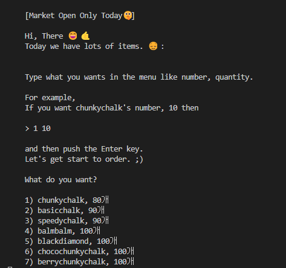
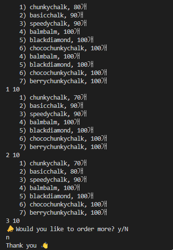

# *toy project* | Only Oneday Open Market

## 👩‍💻프로젝트 개요
- 본 토이 프로젝트는 CLI 마켓을 구현하는 것입니다.
- 일정 횟수로 구매가 이루어지면, 구매를 더 진행할 것인지에 관한 질의문이 출력됩니다.
- 질의문의 응답에 따라 마켓을 계속 이용하거나 마켓 이용을 종료할 수 있습니다.
- 재고가 없는 제품은 sold out으로 표시됩니다.

## 📦사용한 패키지
- dotenv
- mysql

## 🌏구현 결과

## 👣추가되어야 할 것
- 관리자용 재고 보완 쿼리 전송; insert로 구현한 것을 보완하여야 함.
- 재고가 없는 제품은 안내문을 다시 띄울 것.
- 재고가 모두 없는 경우에는 안내문을 띄우고 마켓을 종료할 것.

